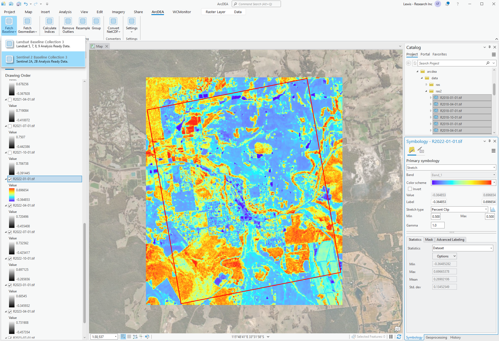

# ArcDEA 

ArcDEA is the unofficial Digital Earth Australia (DEA) ArcGIS Pro plugin. It was developed to provide user-friendly, interactive and efficient access to the Digital Earth Australia (DEA) public data repository. ArcDEA is completely free and open-source.

## Features
* user-friendly interface for downloading bulk analysis ready Landsat 5-9, Sentinel 2 and [other](https://www.dea.ga.gov.au/products) products.
* conversion of data into over a dozen spectral indices (e.g., NDVI, NDWI, NDBI, TCAP).
* tools for cleaning, aggregating, interpolating and harmonising the data.
* visualisation and temporal graphing of the data.
* accompanying ArcGIS toolbox that is fully compatible with ArcGIS Pro model builder.

## Screenshot

## Requirements
* ArcGIS Pro version 3.4 or above.
* Minimum 16gb RAM (>= 32gb recommended).
* Internet connection.

## Installation
1. Download the latest release ArcDEA.esriAddinX from [here](https://github.com/lewistrotter/ArcDEA/releases).
2. Double click the file to install add-in.
3. Restart ArcGIS Pro.
4. Access tools via new ArcDEA ribbon tab in ArcGIS Pro.

## Coming soon
* Landsat 7 SLC-gap filling via moving window regression technique.
* Coregistration of full data stacks using affine motion model.
* Histogram matching of full data stacks.
* Image fusion with MODIS via python-based ESTARFM.

## License
...
